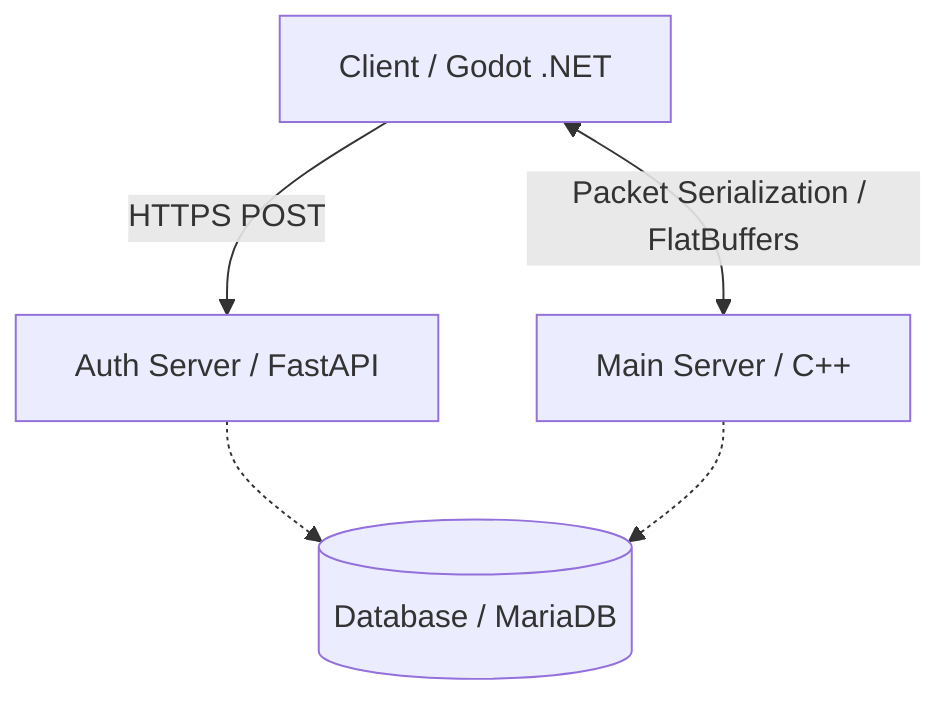
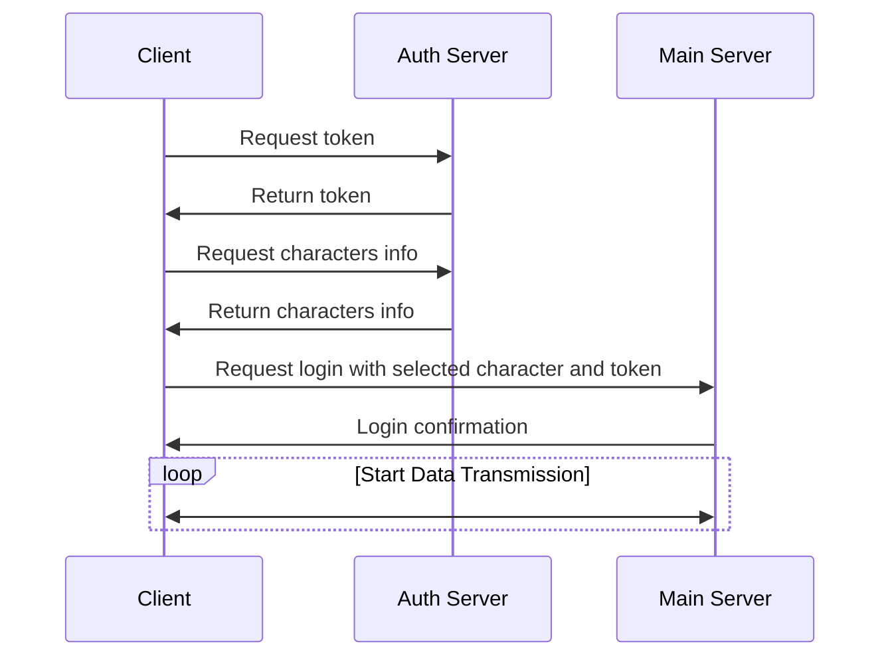

# Tower Backend

A docker compose of Tower backend

### Architecture

```mermaid
graph TD
    C[Client / Godot .NET]
    AS[Auth Server / FastAPI]
    MS[Main Server / C++]
    DB[(Database / MariaDB)]

    C -->|HTTPS POST| AS
    C <-->|Packet Serialization / FlatBuffers| MS
    AS -.-> DB
    MS -.-> DB
```

### Client Authentication Sequence

```mermaid
sequenceDiagram
    participant C as Client
    participant A as Auth Server
    participant M as Main Server

    C->>A: Request token
    A->>C: Return token
    C->>A: Request characters info
    A->>C: Return characters info 
    C->>M: Request login with selected character and token
    M->>C: Login confirmation
    loop Start Data Transmission
        C<<->>M: 
    end
```

## Setup

* Populate [secrets](./secrets) using [script](./secrets/generate_secrets.py).
